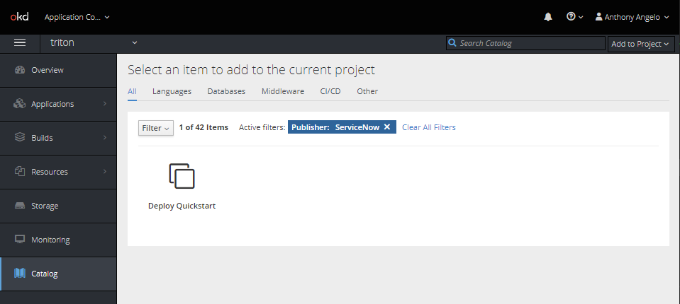

# Prerequisites

* OKD Cluster Admin Access
* ServiceNow HI Portal Access

# Summary

Quickstart is a ServiceNow demonstration environment designed to support presales activities efficiently using containerized applications needed to showcase the ServiceNow DevOps product launch. After the initial setup of the OpenShift namespace and the deployment of all base images, the QuickStart administrator creates containers for users and coordinates the integration with their ServiceNow instances. 

# Creating the QuickStart Namespace

Before you can deploy QuickStart Containers the OKD administrator needs to perfom the initial configuration of a namespace and install the supporting templates and images as follows:

1. Login to [OKD](https://openshift.sytes.net:8443) as Cluster Administrator

1. Create Namespace (e.g. `triton`)

    ```
    oc create namespace triton
    oc project triton
    ```
1. Create Service Account

    ```
    oc create serviceaccount triton
    ```

1. Grant rights to Service Account

    ```
    oc adm policy add-scc-to-user anyuid -z triton -n triton
    ```

1. Clone Project

    ```
    git clone git@github.com:advlab/triton.git
    cd triton
    ```

1. Create Git Key

    ```
    ssh-keygen -t rsa -b 4096 -C "triton@noreply.com" -f $HOME/.ssh/triton
    ```

1. Configure [GitHub Project](https://github.com/advlab/triton) Deploy Key using the Git Key from above

1. Create GitHub Secret

    ```
    oc create secret generic github-triton --type=kubernetes.io/ssh-auth --from-file=ssh-privatekey=$HOME/.ssh/triton
    ```

1. Annotate Secret

    ```
    oc annotate secret/github-triton 'build.openshift.io/source-secret-match-uri-1=git@github.com/advlab/triton.git'
    ```

1. Create Image Streams

    ```
    oc process -f build-quickstart-imagestreams.yml | oc apply -f -
    ```

1. Build Images

    ```
    oc process -f build-quickstart-images.yml | oc apply -f -
    oc start-build build-tomcat-image && oc start-build build-jenkins-image
    ```

1. Deploy Template

    ```
    oc create -f deploy-quickstart.yml
    ```

1. Test Deployment

    Example:
    ```
    oc new-app -f deploy-quickstart.yml \
    -p CUSTOMER_ID=creditsuisse \
    -p GITHUB_ID=devopsmaniac \
    -p TOMCAT_USER=admin \
    -p TOMCAT_PASSWORD=changeit \
    -p JENKINS_USER=admin \
    -p JENKINS_PASSWORD=changeit \
    -l app=creditsuisse
    ```

# Creating the QuickStart Containers

Creating QuickStart containers is easy and it consists of running a QuickStart template from the Catalog and providing a couple of parameters before kicking it off as follows:

1. Login to OKD

1. Press `Add to Project > Browse Catalog`

1. Fiter by `ServiceNow` Publisher

    

1. Select the `Deploy Quickstart` Template

1. Press `Next`

1. Configure Template as follows:

    * Customer ID (e.g. `acme`)
    * GitHub ID (e.g. `dsmith`)
    * Tomcat User (e.g. `admin`)
    * Tomcat Password (e.g. `changeit`)
    * Jenkins User (e.g. `admin`)
    * Tomcat Password (e.g. `changeit`)
    * Tomcat Memory Limit (e.g. `1Gi`)
    * Jenkins Memory Limit (e.g. `1Gi`)
    * Jenkins Volume Capacity (e.g. `5Gi`)

1. Press `Create`

1. Navigate to `Overview`

    The Application you created will be listed grouped by Pod. Visit each Pod to note the avaiable Routes to each Pod. The Routes are named according to the following naming convention where `NAMESPACE=triton` for this installation:

    * http://CUSTOMER_ID-jenkins-NAMESPACE-openshift.sytes.net
    * http://CUSTOMER_ID-tomcat-NAMESPACE-openshift.sytes.net

    The Jenkins Pod is configured to deploy (2) two web applications and the URLs are as follows:

    * http://CUSTOMER_ID-tomcat-NAMESPACE-openshift.sytes.net/globex-web-prod
    * http://CUSTOMER_ID-tomcat-NAMESPACE-openshift.sytes.net/globex-web-uat