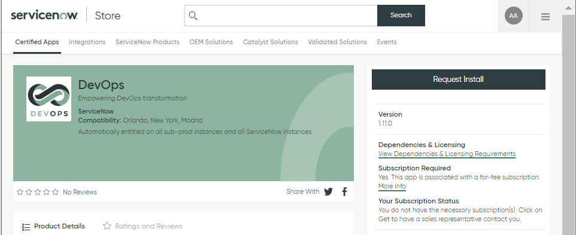
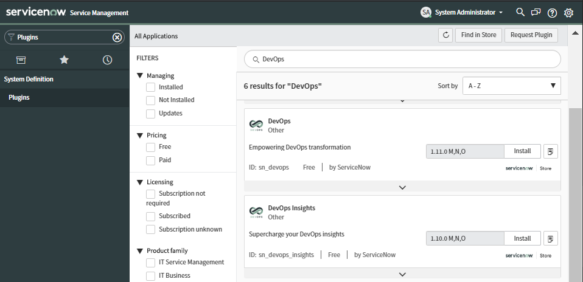

# Prerequisites

* ServiceNow HI Portal Access
* Personal GitHub.com Account

# Summary

Installing QuickStart consists of creating a ServiceNow instance, deploying the DevOps Plugin and requesting the QuickStart containers to be depoyed. Last step is to connect your ServiceNow instance to the containers and you should be ready to perform demonstrations.

# Clone Demo Web Site

1. Login to your personal GitHub.com Account

1. Create a `New` Repository

1. Click on the **Import a Repository** link

1. Provide the Demo Web Site URL as follows:
    
    https://github.com/DevOpsManiac/CorpSite

1. Provide the name of your Repository (e.g. `CorpSite`)

1. Press the **Begin Import** Button

# Request QuickStart Containers

Request QuickStart Containers from the QuickStart administrator and provide the URL your GitHub.com *Corp Site* project (e.g. `https://github.com/dsmith/CorpSite`). After creation you will receive back URL's and credentials for your containers.
    
# Creating the ServiceNow Instance

When using QuickStart containers you will need to create a ServiceNow instance and configure it for DevOps integrations with the QuickStart containers as follows:

## Request an Instance from HI Portal Service Catalog

1. Login to [HI](https://hi.service-now.com/hisp?id=hisp_service_catalog) Portal Service Catalog

1. Request a **New Internal Instance Request** with latest Application Version (e.g. `New York Patch 6`)

    

>NOTE: The request can take several hours to provision. Watch your E-Mail Inbox.

1. Once you receive a `Provision result notification` E-Mail from HI, safeguard the `admin` User Password for later use

## Install Prerequisite ServiceNow Plugins

You will need to install several required PlugIns into your ServiceNow instance before being able to install the latest DevOps Plugin. Some of these PlugIns require accessing the instance using `Maintenance Mode` which can be established using the **ServiceNow HI Hop** Portal.

1. Login to [HI Hop](https://hihop.service-now.com)

1. Select the **Hop Dashboard** Menu Option and search for your instance as follows

    

1. Press the `Log on` button to reveal your credentials

1. Click on the **To log on with full access, click here** link and note the credentials for the `maint,admin,itil` Role which are your `User Name` and `Normal Password`. These are your `Maintenance Mode` credentials

1. Login to your instance using the `Maintenance Mode` credentials

1. Select the **Plugins** Menu Option

    

1. Continue to *Search*, *Install* and *Activate* each of the following Plugins:

    >NOTE: It can take several minutes to *Activate* each Plugin

    * Agile 2.0 (ID: *com.snc.sdlc.agile.2.0*)
    * ServiceNow IntegrationHub Starter Pack Installer (ID: *com.glide.hub.integrations*)
    * Performance Analytics (ID: *com.snc.pa*)
    * Explicit Roles (ID: *com.glide.explicit_roles*)

## Install the DevOps Plugin

1. Login to the [ServiceNow Store](https://store.servicenow.com)

1. Search for the DevOps Plugin by using this [link](https://store.servicenow.com/sn_appstore_store.do#!/store/application/34cfa6f087302300f97abba826cb0b54)

    >NOTE: The DevOps Plugin is currently available as a *limited* release to *qualified customers* only and not listed as a generally available application in the ServiceNow Store

1. Press the `Request Install` Button to request approval

    

1. Validate your instance name and press `Request`

    

    >NOTE: The DevOps Plugin may take several minutes to be approved on your instance

1. Login back to your instance as Administrator

1. Select the **Plugins** Menu Option and *Search* and *Install* the following Plugins `DevOps` Plugins:

    

    >NOTE: We recommed installing the DevOps `demo data` with the Plugin to better understand its features
    
    * DevOps (Empowering DevOps Transformation)
    * DevOps Insights (Supercharge your DevOps Insights)