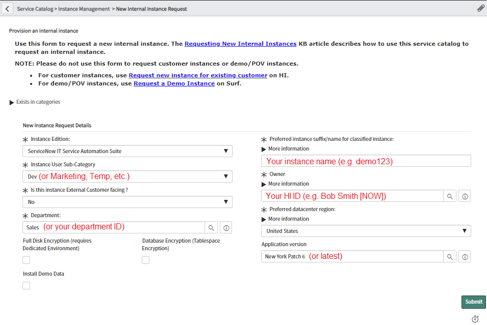
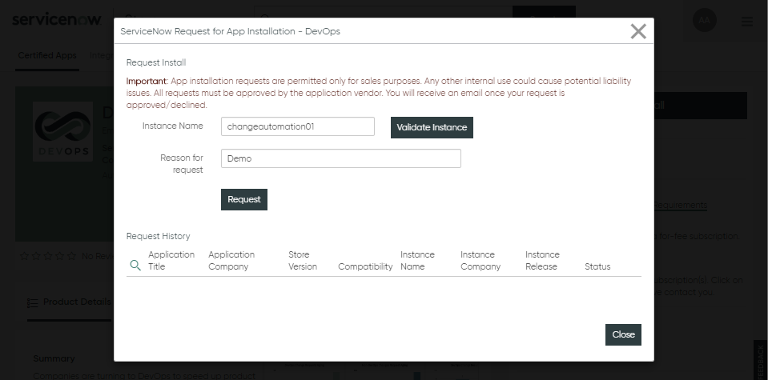

# Prerequisites

* OKD Cluster Admin Access
* ServiceNow HI Portal Access

# Summary

Installing QuickStart consists of initially setting the OpenShift Cluster namespace and allowing users to create their own QuickStart containers using the Catalog to kick off templated container deployments.

# Creating the QuickStart Namespace

Before you can deploy QuickStart Containers the OKD administrator needs to perfom the initial configuration of a namespace and install the supporting templates and images as follows:

1. Login to [OKD](https://openshift.sytes.net:8443) as Cluster Administrator

1. Create Namespace (e.g. `triton`)

    ```
    oc create namespace triton
    oc project triton
    ```
1. Create Service Account

    ```
    oc create serviceaccount triton
    ```

1. Grant rights to Service Account

    ```
    oc adm policy add-scc-to-user anyuid -z triton -n triton
    ```

1. Clone Project

    ```
    git clone git@github.com:advlab/triton.git
    cd triton
    ```

1. Create Git Key

    ```
    ssh-keygen -t rsa -b 4096 -C "triton@noreply.com" -f $HOME/.ssh/triton
    ```

1. Configure [GitHub Project](https://github.com/advlab/triton) Deploy Key using the Git Key from above

1. Create GitHub Secret

    ```
    oc create secret generic github-triton --type=kubernetes.io/ssh-auth --from-file=ssh-privatekey=$HOME/.ssh/triton
    ```

1. Annotate Secret

    ```
    oc annotate secret/github-triton 'build.openshift.io/source-secret-match-uri-1=git@github.com/advlab/triton.git'
    ```

1. Create Image Streams

    ```
    oc process -f build-quickstart-imagestreams.yml | oc apply -f -
    ```

1. Build Images

    ```
    oc process -f build-quickstart-images.yml | oc apply -f -
    oc start-build build-tomcat-image && oc start-build build-jenkins-image
    ```

1. Deploy Template

    ```
    oc create -f deploy-quickstart.yml
    ```

1. Test Deployment

    Example:
    ```
    oc new-app -f deploy-quickstart.yml \
    -p CUSTOMER_ID=creditsuisse \
    -p GITHUB_ID=devopsmaniac \
    -p TOMCAT_USER=admin \
    -p TOMCAT_PASSWORD=changeit \
    -p JENKINS_USER=admin \
    -p JENKINS_PASSWORD=changeit
    ```

# Creating the QuickStart Containers

Creating QuickStart containers is easy and it consists of running a QuickStart template from the Catalog and providing a couple of parameters before kicking it off as follows:

1. Login to OKD

1. Press `Add to Project > Browse Catalog`

1. Fiter by `ServiceNow` Publisher

    

1. Select the `Deploy Quickstart` Template

1. Press `Next`

1. Configure Template as follows:

    * Customer ID (e.g. `acme`)
    * GitHub ID (e.g. `dsmith`)
    * Tomcat User (e.g. `admin`)
    * Tomcat Password (e.g. `changeit`)
    * Jenkins User (e.g. `admin`)
    * Tomcat Password (e.g. `changeit`)
    * Tomcat Memory Limit (e.g. `1Gi`)
    * Jenkins Memory Limit (e.g. `1Gi`)
    * Jenkins Volume Capacity (e.g. `5Gi`)

1. Press `Create`

1. Navigate to `Overview`

    The Application you created will be listed grouped by Pod. Visit each Pod to note the avaiable Routes to each Pod. The Routes are named according to the following naming convention where `NAMESPACE=triton` for this installation:

    * http://CUSTOMER_ID-jenkins-NAMESPACE-openshift.sytes.net
    * http://CUSTOMER_ID-tomcat-NAMESPACE-openshift.sytes.net

    The Jenkins Pod is configured to deploy (2) two web applications and the URLs are as follows:

    * http://CUSTOMER_ID-tomcat-NAMESPACE-openshift.sytes.net/globex-web-prod
    * http://CUSTOMER_ID-tomcat-NAMESPACE-openshift.sytes.net/globex-web-uat


# Creating the ServiceNow Instance

When using QuickStart containers you will need to create a ServiceNow instance and configure it for DevOps integrations with the QuickStart containers as follows:

## Request an Instance from HI Portal Service Catalog

1. Login to [HI](https://hi.service-now.com/hisp?id=hisp_service_catalog) Portal Service Catalog

1. Request a **New Internal Instance Request** with latest Application Version (e.g. `New York Patch 6`)

    

>NOTE: The request can take several hours to provision. Watch your E-Mail Inbox.

1. Once you receive a `Provision result notification` E-Mail from HI, safeguard the `admin` User Password for later use

## Install Prerequisite ServiceNow Plugins

You will need to install several required PlugIns into your ServiceNow instance before being able to install the latest DevOps Plugin. Some of these PlugIns require accessing the instance using `Maintenance Mode` which can be established using the **ServiceNow HI Hop** Portal.

1. Login to [HI Hop](https://hihop.service-now.com)

1. Select the **Hop Dashboard** Menu Option and search for your instance as follows

    

1. Press the `Log on` button to reveal your credentials

1. Click on the **To log on with full access, click here** link and note the credentials for the `maint,admin,itil` Role which are your `User Name` and `Normal Password`. These are your `Maintenance Mode` credentials

1. Login to your instance using the `Maintenance Mode` credentials

1. Select the **Plugins** Menu Option

    

1. Continue to *Search*, *Install* and *Activate* each of the following Plugins:

    >NOTE: It can take several minutes to *Activate* each Plugin

    * Agile 2.0 (ID: *com.snc.sdlc.agile.2.0*)
    * ServiceNow IntegrationHub Starter Pack Installer (ID: *com.glide.hub.integrations*)
    * Performance Analytics (ID: *com.snc.pa*)
    * Explicit Roles (ID: *com.glide.explicit_roles*)

## Install the DevOps Plugin

1. Login to the [ServiceNow Store](https://store.servicenow.com)

1. Search for the DevOps Plugin by using this [link](https://store.servicenow.com/sn_appstore_store.do#!/store/application/34cfa6f087302300f97abba826cb0b54)

    >NOTE: The DevOps Plugin is currently available as a *limited* release to *qualified customers* only and not listed as a generally available application in the ServiceNow Store

1. Press the `Request Install` Button to request approval

    

1. Validate your instance name and press `Request`

    

    >NOTE: The DevOps Plugin may take several minutes to be approved on your instance

1. Login back to your instance as Administrator

1. Select the **Plugins** Menu Option and *Search* and *Install* the following Plugins `DevOps` Plugins:

    

    >NOTE: We recommed installing the DevOps `demo data` with the Plugin to better understand its features
    
    * DevOps (Empowering DevOps Transformation)
    * DevOps Insights (Supercharge your DevOps Insights)