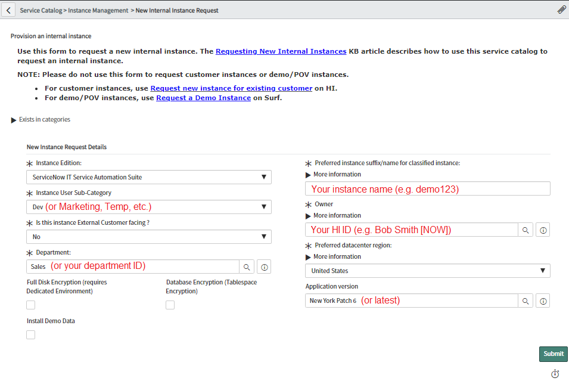
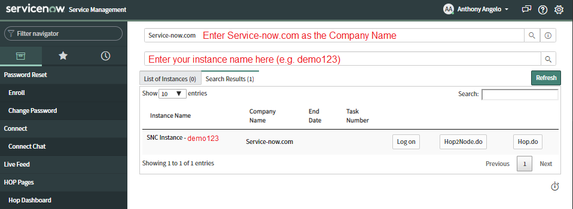
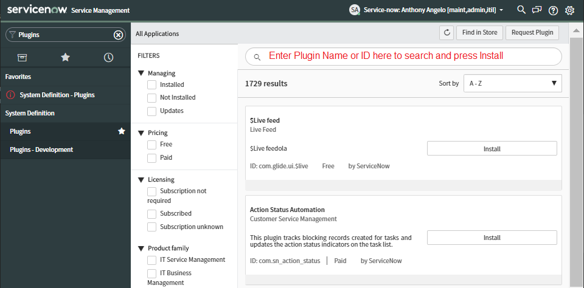

# Creating ServiceNow Instance

## Create ServiceNow Instance

1. Login to [HI](https://hi.service-now.com/hisp?id=hisp_service_catalog) Portal Service Catalog

1. Request a `New Internal Instance Request` with latest Application Version (e.g. `New York Patch 6`)

    

>NOTE: The request can take several hours to provision. Watch your E-Mail Inbox.

1. Once you receive a `Provision result notification` E-Mail from HI, safeguard the `admin` User Password for later use

## Install Prerequisite ServiceNow Plugins

You will need to install several required PlugIns into your ServiceNow instance before being able to install the latest DevOps Plugin. Some of these PlugIns require accessing the instance using `Maintenance Mode` which can be established using the **ServiceNow HI Hop** Portal.

1. Login to [HI Hop](https://hihop.service-now.com)

1. Select the `Hop Dashboard` Menu Option and search for your instance as follows

    

1. Press the `Log on` button to reveal your credentials

1. Click on the `To log on with full access, click here` link and note the credentials for the `maint,admin,itil` Role which are your `User Name` and `Normal Password`. These are your `Maintenance Mode` credentials

1. Login to your instance using the `Maintenance Mode` credentials

1. Select the `Plugins` Menu Option

    

1. Continue to *Search*, *Install* and *Activate* each of the following Plugins:    

    * Agile 2.0 (ID: *com.snc.sdlc.agile.2.0*)
    * Integration Hub (ID: *com.glide.hub.integrations*)
    * Performance Analytics (ID: *com.snc.pa*)
    * Explicit Roles (ID: *com.glide.explicit_roles*)

    >NOTE: Be patient, it can take several minutes to *Activate* each Plugin